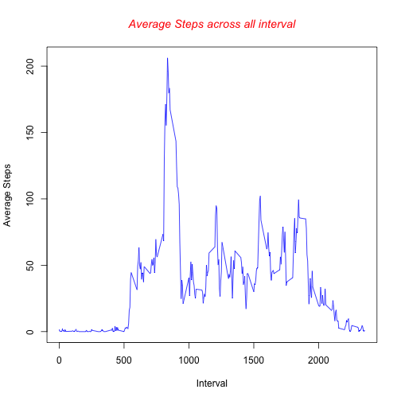
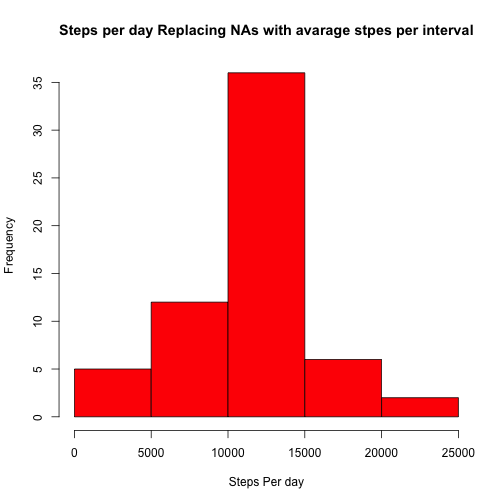

"Reproducible Research: Peer Assessment 1"
=============================================================================================================


```r
  ## Library Inclusion  
  suppressPackageStartupMessages(library(tidyr))
  suppressPackageStartupMessages(library(reshape2))
  suppressPackageStartupMessages(library(proto))
  suppressPackageStartupMessages(library(DBI))
  suppressPackageStartupMessages(library(RSQLite))
  suppressPackageStartupMessages(library(Cairo))
  suppressPackageStartupMessages(library(tcltk2))
  suppressPackageStartupMessages(library(gsubfn))
  suppressPackageStartupMessages(library(sqldf))
  suppressPackageStartupMessages(library(qdapTools))
  suppressPackageStartupMessages(library(lattice))
  
  ## Setting up the processing directory , which in my case i set it up as current directory

  landdir<-paste(getwd(),"/",sep="")
  setwd(landdir)
```

### Loading and preprocessing the data


```r
  ## Reading data from file "activity.csv" and creating two dataset one with and another without NAs 
  rawdataNA<-read.csv("activity.csv",sep=",",header=TRUE)
  rawdata<-rawdataNA[!is.na(rawdataNA$steps),]
```

### What is mean total number of steps taken per day?


```r
  ## Calculating total number of steps per day excluding NAs
  sqlstr<-'select sum(steps) datesteps, date from rawdata where steps<>"NA" group by date  '
  q1data<- sqldf(sqlstr)
  
  ## Histogram for number of steps per days excluding NAs
  hist(as.numeric(as.vector(q1data$datesteps)),col='red',xlab="Steps Per day",main="Steps per day excluding NAs")
```

 

```r
   ## Mean of total number of steps per day excluding NAs
  mean(q1data$datesteps)
```

```
## [1] 10766.19
```

```r
  ## Median of total number of steps per day excluding NAs
  median(q1data$datesteps)
```

```
## [1] 10765
```

### What is the average daily activity pattern?


```r
  ## Finding avrage steps for intervals excluding NAs
  sqlstrint <-'select avg(steps) intervalsteps,interval from rawdata where steps<>"NA" group by interval'
  q2data<-sqldf(sqlstrint)
  with(q2data,plot(as.vector(q2data$interval),as.vector(q2data$intervalsteps),type="l",xlab="Interval",ylab="Average Steps",col="blue"))
  title(main=list("Average Steps across all interval",col = "red", font = 3))
```

 

```r
  #text(x=as.vector(q2data$interval),y=as.vector(q2data$intervalsteps))
  
  ## Finding interval with highest avarage Steps (excluding NAs)
  sqlstrhighint <-'select max(intervalsteps) MaxAvgSteps,interval from q2data'
  sqldf(sqlstrhighint)
```

```
##   MaxAvgSteps interval
## 1    206.1698      835
```

```r
  ## Finding Count of NAs in the original dataset
  sum(is.na(rawdataNA$steps))
```

```
## [1] 2304
```

### Imputing missing values


```r
  ## Replacing NAs with average steps per interval 
  dataNA<-rawdataNA[is.na(rawdataNA$steps),]
  newdata<-merge(dataNA[,c("interval","date")],q2data,by="interval")
  names(newdata)<-c("interval","date","steps")
  finaldata<-rbind(rawdata,newdata)

  ## Calculating total number of steps per day with new dataset ( Replacing NAs with average steps per interval)
  sqlstrnd<-'select sum(steps) datesteps, date from finaldata group by date  '
  q3data<- sqldf(sqlstrnd)
  
  ## Histogram for number of steps per days excluding NAs
  hist(as.numeric(as.vector(q3data$datesteps)),col='red',xlab="Steps Per day",main="Steps per day Replacing NAs with avarage stpes per interval")
```

 

```r
  ## Mean of total number of steps per day after replacing NAs
  mean(q3data$datesteps)
```

```
## [1] 10766.19
```

```r
  ## Median of total number of steps per day after replacing NAs
  median(q3data$datesteps)
```

```
## [1] 10766.19
```

### Are there differences in activity patterns between weekdays and weekends?


```r
  ## Determining Weekdays or Weekend and subsequent assignmentto a new variable
 
  finaldata = within(finaldata, {
  WkndInd = ifelse( weekdays(as.POSIXct(finaldata$date)) =="Sunday" | weekdays(as.POSIXct(finaldata$date)) =="Saturday"  , "WeekEnd", "WeekDay")})
  
  ## Average steps against interval for weekday and weekend as well
  
  finalsql <-'select avg(steps) intervalsteps,interval,WkndInd from finaldata group by interval,WkndInd '
  finalset<-sqldf(finalsql)
  xyplot(intervalsteps~interval|WkndInd,finalset,type="l",ylab="Number of Steps",xlab="Interval")
```

 
